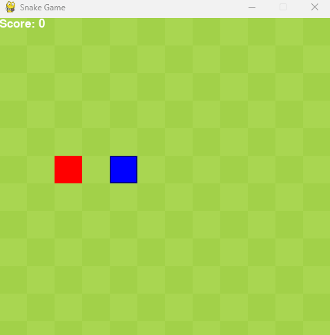

# AI 貪食蛇遊戲

貪食蛇是一款經典的益智遊戲，玩家需要操控蛇吃到更多的食物，同時避免撞到牆壁和自己的身體。本專案的目標是訓練 AI 自動玩這款遊戲，並了解強化學習的基本概念。

這個專案是利用 PyTorch 製作的 AI 貪食蛇遊戲，結合深度強化學習來訓練 AI 自動玩貪食蛇。目標是讓 AI 學會在遊戲中做出更好的決策，提高分數。我們使用 Python 的 Pygame 庫來呈現遊戲畫面，並用深度 Q 網絡（DQN）來訓練 AI，讓它學會如何避開障礙、吃掉食物。

## 目錄

- [專案簡介](#專案簡介)
- [安裝指南](#安裝指南)
- [使用說明](#使用說明)
- [遊戲演示](#遊戲演示)
- [系統需求](#系統需求)
- [功能特色](#功能特色)
- [模型架構](#模型架構)
- [強化學習算法](#強化學習算法)

## 安裝指南

### 1. 下載專案

打開終端機，輸入以下指令來下載專案：

```bash
git clone https://github.com/Wei070901/snake_ai.git
cd snake_ai
```

### 2. 建立虛擬環境並安裝依賴

創建一個虛擬環境來管理專案的依賴：

```bash
python3 -m venv venv
source venv/bin/activate  # Windows 用戶執行 `venv\Scripts\activate`
pip install -r requirements.txt
```

### 3. 安裝 PyTorch

前往 [PyTorch 官方網站](https://pytorch.org/)，根據您的系統選擇適合的安裝指令。

## 項目目標

本項目不僅是要讓 AI 學會玩貪食蛇，還旨在幫助大家了解強化學習的基本概念。這是一個簡單的入門項目，適合對 AI 和機器學習感興趣的初學者。

## 使用說明

### 1. 訓練 AI 模型

運行以下指令開始訓練 AI 模型：

```bash
python train.py
```

可以調整一些訓練參數，例如：

- `learning_rate`：控制模型每次更新時權重的變化幅度，較大的學習率可能加速收斂，但也容易導致不穩定，預設為 0.001。
- `epsilon`：Epsilon-Greedy 策略中的 epsilon 值，這決定了 AI 有多少機會選擇隨機行動以進行探索，隨著訓練進行，這個機率會逐漸減少，讓 AI 更加專注於它已學到的策略，預設為 1.0，隨訓練進行逐漸減少。
- `target_update_freq`：目標網絡的更新頻率，設定為每隔多少步數更新一次目標網絡，通常能提升模型的穩定性。
- `num_episodes`：訓練的回合數，預設為 1000。
- `batch_size`：每次訓練使用的樣本數，預設為 64。
- `gamma`：折扣因子，可以理解為讓 AI 不只關注當前的獎勵，還要考慮未來可能的收益，這樣它能有更好的長遠策略，預設為 0.94。

### 2. 測試 AI 模型

訓練完成後，使用以下指令測試 AI 模型：

```bash
python train.py --test
```

在測試過程中，AI 會根據已學習的策略玩遊戲，並顯示最終得分。測試完成後，系統會輸出一些關鍵數據，例如得分總數和遊戲步數，用於分析 AI 的表現。

### 3. 顯示遊戲畫面

在訓練過程中，可以看到遊戲畫面，觀察 AI 的決策。設置 `render_mode=True` 可以開啟或關閉畫面顯示。

此外，可以查看訓練過程中的詳細日志信息，這些信息會輸出到控制台，包含每一步的行動、獎勵和損失等數據。使用 TensorBoard 來更全面地查看訓練過程中的變化。

## 遊戲演示



上圖顯示了 AI 貪食蛇遊戲的實際操作畫面，紅色方塊為食物，藍色方塊為蛇。

## 系統需求

- Python 3.8 或更高版本
- PyTorch 1.9.0 或更高版本
- Pygame
- Numpy
- TensorBoard（可選，用於監控訓練過程）

## 功能特色

- **智能貪食蛇 AI**：使用深度 Q 網絡（DQN）訓練 AI，讓它學習如何在遊戲中取得高分。
- **動態遊戲畫面**：使用 Pygame 顯示遊戲畫面，方便實時觀察 AI 的行為。
- **經驗回放**：就像是復習一樣，AI 可以儲存之前玩遊戲時的經驗，從過去的經驗中學習，這樣能提高訓練的效果。
- **訓練監控**：使用 TensorBoard 監控訓練過程中的損失和獎勵變化。
- **雙重 DQN**：避免 Q 值的過度估計，提升模型的穩定性和性能。

## 模型架構

我們使用深度 Q 網絡（DQN）進行強化學習，模型結構如下：

- **輸入層**：接收遊戲的狀態資訊，輸入大小為 12，代表蛇的位置、食物的位置等特徵。
  - 這些狀態特徵幫助 AI 了解目前的遊戲環境，例如蛇頭的位置、食物的位置以及蛇的移動方向。
- **隱藏層**：包含兩個全連接層，每層有 256 個神經元，並使用 ReLU 激活函數增加非線性。
  - 隱藏層使模型能夠學習到遊戲中更複雜的特徵和關係，增加模型的表現能力。
- **輸出層**：輸出每個可能行動的 Q 值，用於評估各種行動的預期回報。
  - 每個輸出對應一個可能的行動（例如向上、向下、向左、向右），AI 會選擇具有最高 Q 值的行動。

## 強化學習算法

我們採用了深度 Q 網絡（DQN），並結合以下技術來提升學習效果：

- **Epsilon-Greedy 策略**：在訓練過程中，AI 會以一定機率隨機選擇行動來探索，隨著訓練進行，這個機率會逐漸降低，讓 AI 更專注於已學到的策略。
  - 初期的高隨機性有助於探索不同的策略，隨著訓練的進展，逐漸降低隨機性可以幫助 AI 更加專注於最佳策略。
- **經驗回放**：儲存每一步的狀態、行動、獎勵和下一狀態，隨機抽取樣本來訓練，打破資料的時間相關性，提升訓練穩定性。
  - 這相當於讓 AI 復習以前的經驗，通過隨機抽取，減少連續資料之間的相關性，增強模型的泛化能力。
- **雙重 DQN**：引入目標網絡來計算 Q 值，避免標準 DQN 在估計未來回報時的過度估計問題，提升模型的穩定性和性能。
  - 使用目標網絡來幫助估計未來的回報，這樣可以避免過度樂觀的估計，提升模型的表現。
- **折扣因子（Gamma）**：用來計算未來獎勵的折現值，讓模型既考慮短期收益，也能考慮長期策略的回報。
  - 折扣因子控制了未來獎勵對當前決策的影響程度，較大的折扣因子會讓 AI 更加重視長遠的收益。
